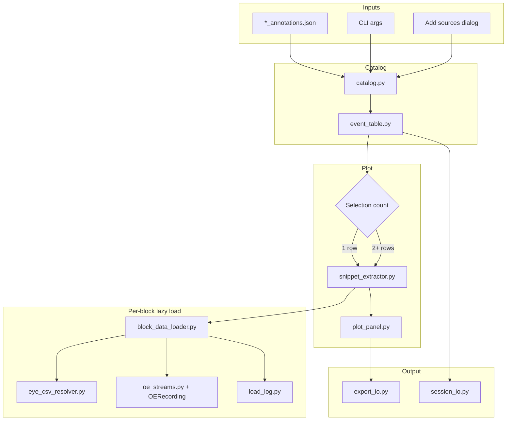

# Event Explorer GUI — Implementation Plan & Agent Prompt

This document is the single source of truth for building the **Event Explorer**: a second-stage PyQt6 GUI for exploring Block Annotator events across blocks — interactive catalog, time-aligned plots, and export — **without video playback in v1**.

**Status:** Draft pending user approval (interview completed 2026-05-23).

---

## 1. Product summary (locked)

| Item | Decision |
|------|----------|
| Purpose | Solo-analyst tool to browse annotated events, inspect time-aligned traces, compute averages, and export NPZ bundles |
| Relationship to Block Annotator | Consumes `*_annotations.json` outputs; complements (does not replace) notebooks or preprocessing pipeline in v1 |
| Relationship to notebooks | Keep options open for future GUI expansion; **do not** replace `manual_outlier_annotation.ipynb` or pipeline steps in v1 |
| Input sources | Flexible catalog: **single JSON**, **list of JSONs**, **one or more folders** (recursive `*_annotations.json` scan), add sources over session via unified **“Add sources…”** dialog |
| Annotation format | Block Annotator schema v1 only (`schema_version: 1`) |
| v1 non-goals | No video playback; no re-annotation; no editing/writing source annotation JSON |
| Master timeline / alignment | All plots align to **`timepoint_ms = 0`** (dotted vertical center line); adjustable ±window (default **100 ms**) |
| Eye slice primary key | `l_eye_frame` / `r_eye_frame` from event metadata → row in resolved eye CSV; **fallback** `ms_axis` slice with **log entry** |
| OE time base | Same as Block Annotator: `start_time_ms` = zeroed OE clock matching `ms_axis` (`oe_streams.py` convention) |
| Eye CSV resolution | Per side: pick **most recent** file matching `left_eye_data*.csv` / `right_eye_data*.csv` under `block/analysis/` (names not standardized yet) |
| Stale sync guard | If `final_sync_df.csv` mtime **newer** than chosen eye CSV → **warn + require per-block user confirmation** before load |
| Broken `block_path` | Interactive **remap** dialog (do not silently fail) |
| Plot streams (v1 toggles) | Pupil diameter, left degrees, right degrees, EP trace (OE headstage) |
| EP trace default | **Off** by default; when enabled default **HS ch1**; user-editable as int or list `[1,2,3,…]` |
| Selection modes | **1 row:** multi-stream overlay, event at t=0. **2+ rows:** **one** stream type at a time, per-trial colors, **black thick mean**, mean ± SEM, N in legend, normalization dropdown |
| Export | **NPZ** + **sidecar JSON** (provenance + load-log excerpt); user picks folder each export |
| Session | **JSON** session file; **manual save**; on exit if dirty → “Save session?” → if yes, pick location |
| Load audit | **GUI log panel** + **auto-written log file** per run (retraceable file-resolution chain) |
| Config file (v1) | **None** — defaults in code; **event types inferred** from loaded annotation files; stream/column overrides via session JSON only |
| Tech | **PyQt6** + **pyqtgraph** (interactive; match annotator) ± **matplotlib** for export if needed; same conda env **`eye_annotator`** |
| Scale target | ~10² events, ~1–5 blocks per session; on-demand snippet load; **memory cache only** (no disk snippet cache v1) |
| Sample QA block | `D:\sample_data_for_eye_repo\PV_106\2025_09_04\block_015` + `_annotator_out/PV_106_2025_09_04_block_015_annotations.json` |

---

## 2. User requirements (numbered)

### 2.1 Startup & catalog

1. Launch: `python -m eye_tracking_system_tools.annotation.event_explorer`
2. CLI (optional): `--json PATH`, `--json-list PATH`, `--scan-dir ROOT` (repeatable). If no args, show startup / “Add sources…” dialog.
3. **“Add sources…”** supports in one flow:
   - Pick individual `*_annotations.json` files
   - Pick folder(s) — non-recursive or recursive scan for `*_annotations.json`
   - Add more sources anytime via menu (multi-folder catalog grows over session)
4. Parse all discovered JSON files → unified in-memory **event catalog** (one row per event).
5. **Event types** for filters/dropdowns = **union of `event_type` values** across loaded files (not from `annotator_config.yaml`).

### 2.2 Block resolution & load audit

6. For each event, resolve `block_path` from JSON. If path missing/invalid → **remap dialog** (user picks correct block folder); store mapping for session (and in session JSON if saved).
7. Per block, load lazily on first event access from that block:
   - `analysis/final_sync_df.csv` via `load_final_sync_df` / `BlockSync` patterns
   - Eye CSV per side: glob `left_eye_data*.csv` / `right_eye_data*.csv` (and symmetric `right_*`); choose **newest by mtime**; log all candidates considered + chosen file + reason
   - OE: `OERecording` via existing `block_loader` / `BlockSync` path when `oe_files/` present
8. **Stale sync check:** compare mtime(`final_sync_df.csv`) vs mtime(chosen L/R eye CSV). If sync newer → modal per block: “Eye CSV may be stale — continue?” (Yes/No). No = skip block plots for that block until remapped/reloaded.
9. **Load log (required):**
   - QTextEdit or dedicated dock: timestamped INFO/WARN lines for every resolution decision
   - Auto-append same lines to `{user_chosen_log_dir_or_session_dir}/explorer_load_{timestamp}.log` (default: same folder as session JSON if saved, else user home / temp — prompt once or use export folder’s parent)
   - Log must include: annotation file path, block_path used, eye CSV candidates + selection, frame-vs-ms_axis fallback, stale-sync decisions, OE channel list, remap actions

### 2.3 Event table

10. **Columns (all available; visibility via dropdown checklist, extensible later):**
    - `event_type`, `animal_call`, `experiment_date`, `block_num`, `timepoint_ms`, `start_ms`, `end_ms`, `note`
    - `arena_frame`, `l_eye_frame`, `r_eye_frame`, `row_index`
    - Block status flags: L eye / R eye / OE / stale-sync warning
    - Source annotation file path
11. **Filters (all in v1):** event type (multi), animal, block, date range, `timepoint_ms` range, note text search, data-availability (has L eye, R eye, OE).
12. **Sort:** click column header; **no row grouping** in v1.
13. **Selection:**
    - Single row → **single-trial mode** (§2.4)
    - Multi-row → **average mode** (§2.5)
14. **Row actions:** preview (update plots), export selection. **No** exclude/reject/tag in v1; **no** writing annotation JSON.

### 2.4 Single-trial plot mode (exactly one selected row)

15. Time axis: relative ms with **t = 0 at `timepoint_ms`**; **dotted vertical line** at 0.
16. **Window control:** numeric field “± \_\_\_ ms” (default **100**, editable; updates plot on change).
17. **Stream toggles** (independent): pupil diameter, left degrees, right degrees, EP trace.
18. Each enabled stream = separate trace, distinct color, **auto-updating legend** (stream name + units if known).
19. Eye data extraction:
    - Map `l_eye_frame` / `r_eye_frame` → row(s) in resolved eye CSV (handle varying column prefixes, e.g. `L_eye_frame` vs `eye_frame`)
    - Window in **frame space** around event frame equivalent to ±window_ms (use `ms_axis` or per-row timing in eye CSV to convert ms window → frame span)
    - If frame lookup fails → fallback slice on `ms_axis` in eye CSV; **log WARN** with event id
20. EP trace: only if toggle on; fetch via `oe_streams._fetch_window` / `get_data` for configured channel(s); off by default.

### 2.5 Multi-trial average mode (2+ selected rows)

21. User may enable **only one** stream type at a time (radio or exclusive toggle group).
22. Align each trial to its own `timepoint_ms = 0`; resample/interpolate to common relative time grid (document method in code).
23. Plot all trials in **different colors** + **black thicker mean** line.
24. Show **mean ± SEM** shaded band; legend includes **N trials**.
25. **Normalization dropdown:** None | per-trial z-score | baseline divide (pre-event window −100…0 ms relative) | min-max per trial [0,1].
26. If trials span different blocks → each block’s data loaded with that block’s resolved CSV/OE; log block per trial.

### 2.6 Stream column mapping

27. **Auto-detect** columns in resolved eye CSV:
    - **Pupil diameter:** prefer `width`/`height` ellipse axes → diameter proxy (document formula, e.g. mean of axes or `2*sqrt(a*b)`); match `*width*`, `*height*`, `pupil*` patterns
    - **Left/right degrees:** columns matching `*deg*`, `Kerr*`, `L_degrees`, `R_degrees`, `*_kerr_*` etc.; side inferred from filename or column prefix
28. **Override:** store per-side column names in **session JSON** when user overrides (optional UI “column mapping…” in v1 or Phase 6 — minimum: session JSON keys `pupil_column`, `l_degrees_column`, `r_degrees_column`).
29. If column missing for toggled stream → flat/no plot + log WARN (no crash).

### 2.7 Export

30. User picks export directory via dialog (each export).
31. Format: **NPZ** containing aligned time axis, per-trial arrays, mean/SEM if multi-select, metadata struct.
32. **Sidecar JSON** alongside NPZ: event ids, block_paths, annotation sources, eye CSV paths used, OE channels, alignment (`timepoint_ms=0`), window_ms, normalization mode, stream name, tool version, **excerpt of load log** relevant to exported events.
33. Naming suggestion (user may edit in dialog): `explorer_export_{timestamp}.npz` + `explorer_export_{timestamp}.json`.

### 2.8 Session persistence

34. **Manual “Save session”** → user picks path (`*.explorer_session.json`).
35. Session stores: catalog source list (json paths / scan roots), block path remap table, visible columns, filter state, ±window ms, stream toggles, OE channel list, normalization mode, column overrides, last log file path.
36. **Load session** (menu): restore above; re-validate block paths (remap if needed).
37. On application exit: if session dirty → prompt **“Save session before exit?”** Yes → save dialog; No → discard; Cancel → stay.

### 2.9 Environment & dependencies

38. Reuse conda env **`eye_annotator`** (`environment_annotator.yml`); extend `[annotator]` extra in `pyproject.toml` only if new deps required (likely none beyond existing PyQt6/pyqtgraph/PyYAML/numpy/pandas).
39. No new conda env file in v1.

---

## 3. Data model

### 3.1 Catalog row (`EventRecord`)

| Field | Type | Source |
|-------|------|--------|
| `event_id` | str | JSON `id` |
| `event_type` | str | JSON |
| `animal_call`, `experiment_date`, `block_num` | str | JSON |
| `timepoint_ms`, `start_ms`, `end_ms` | float | JSON |
| `row_index`, `arena_frame`, `l_eye_frame`, `r_eye_frame` | int? | JSON |
| `note` | str | JSON |
| `annotation_path` | Path | source file |
| `block_path` | Path | JSON or remapped |
| `block_status` | enum flags | computed on block load |

### 3.2 Block cache entry (`BlockDataCache`)

| Field | Description |
|-------|-------------|
| `block_path` | Resolved path |
| `final_sync_df`, `ms_axis`, `sample_rate_hz` | From `block_loader` patterns |
| `le_csv_path`, `re_csv_path` | Chosen files + mtime |
| `le_df`, `re_df` | Loaded dataframes |
| `oe_rec` | Optional `OERecording` |
| `column_map` | Resolved pupil / degrees column names |
| `stale_sync_acknowledged` | bool |

### 3.3 Snippet (`EventSnippet`)

| Field | Description |
|-------|-------------|
| `event_id`, `stream_id` | Keys |
| `time_rel_ms` | 1D aligned relative time |
| `values` | 1D or 2D samples |
| `source` | `"frame"`, `"ms_axis_fallback"`, `"oe"` |
| `meta` | channel, column name, block_path |

### 3.4 Export bundle schema

**NPZ keys (minimum):** `time_rel_ms`, `trials` (object array or stacked 2D), `trial_event_ids`, `stream_name`, `mode` (`single`|`average`), `mean`, `sem` (if average), `normalization`.

**Sidecar JSON:** mirror §2.7 plus `schema_version: 1`, `explorer_version`, `export_timestamp`, `load_log_excerpt[]`.

### 3.5 Session JSON (`schema_version: 1`)

Sources, remaps, UI state, column overrides, oe_channels, dirty flag omitted on disk.

---

## 4. Architecture

### 4.1 Module tree

```
src/eye_tracking_system_tools/annotation/
  event_explorer/
    __main__.py           # CLI + launch
    app.py                # QApplication, main window, menus, exit-save prompt
    models.py             # EventRecord, BlockDataCache, EventSnippet, ExportSpec
    catalog.py            # scan/load *_annotations.json → EventRecord list
    source_dialog.py      # unified Add sources (files / folders / recursive)
    block_data_loader.py  # resolve block, eye CSV pick, stale sync, OE, remap
    eye_csv_resolver.py   # glob newest left/right_eye_data*.csv; column auto-detect
    snippet_extractor.py  # frame-first slice + ms_axis fallback
    plot_panel.py         # single vs average modes, pyqtgraph (+ mpl export hook)
    event_table.py        # table model, filters, column visibility menu
    load_log.py           # GUI log + file append
    export_io.py          # NPZ + sidecar JSON
    session_io.py         # load/save session JSON
    remap_dialog.py       # broken block_path picker
    stale_sync_dialog.py  # per-block confirmation
```

### 4.2 Data flow



### 4.3 Dependencies

Reuse existing `[annotator]` extra (`PyQt6`, `pyqtgraph`, `PyYAML`, `numpy`, `pandas`, `opencv-python`). Add `matplotlib` only if export-quality figures need it.

---

## 5. Reuse map

| Source | Reuse |
|--------|--------|
| `block_annotator.models.AnnotationEvent` | Parse events; extend to `EventRecord` |
| `block_annotator.persistence` | JSON load patterns, filename conventions |
| `block_annotator.block_loader` | `infer_metadata`, `load_block_session` pieces, `compute_ms_axis` |
| `block_annotator.oe_streams` | `list_oe_streams`, `_fetch_window`, time alignment comments |
| `preprocessing.OERecording` | `get_data` / `get_analog_data` |
| `preprocessing.block_sync_core.load_final_sync_df` | Sync CSV load |
| `BLOCK_ANNOTATOR_IMPLEMENTATION_PLAN.md` | Phased acceptance-check style |

| Do not duplicate | Use instead |
|------------------|-------------|
| ms_axis ↔ OE alignment | Import / call `oe_streams` helpers |
| Eye CSV load order logic | Extend `block_loader._load_ellipse_csv` patterns + **newest-match glob** |
| Video / playback | **Out of scope v1** |

---

## 6. Implementation phases

Each phase ends with **acceptance checks**; builder must not proceed until checks pass.

### Phase 0 — Scaffold & launch

- [ ] Package layout under `event_explorer/`
- [ ] `python -m eye_tracking_system_tools.annotation.event_explorer` opens main window
- [ ] CLI: `--json`, `--json-list`, `--scan-dir` (document in module `--help`)
- [ ] Empty state UI: “Add sources…” button

**Acceptance:** App launches in `eye_annotator` env; CLI `--help` lists args; no import errors.

### Phase 1 — Catalog & event table

- [ ] `catalog.py`: load schema v1 JSON; build `EventRecord` list
- [ ] `source_dialog.py`: add files, folders, recursive scan
- [ ] `event_table.py`: all columns; column-visibility dropdown; header sort
- [ ] Filters: event type, animal, block, date, ms range, note search, data availability (stub flags OK until Phase 2)
- [ ] Event types populated from loaded files

**Acceptance:** Load `_annotator_out/PV_106_2025_09_04_block_015_annotations.json` → 2 rows visible; filters reduce rows; columns toggle.

### Phase 2 — Block load, eye CSV resolution, load log

- [ ] `block_data_loader.py` + `eye_csv_resolver.py`: lazy block load; newest `left_eye_data*.csv` / `right_eye_data*.csv`
- [ ] `load_log.py`: GUI panel + file append; log candidate files and final choice
- [ ] `stale_sync_dialog.py`: per-block confirm when sync newer than eye CSV
- [ ] `remap_dialog.py`: broken `block_path` → user folder pick
- [ ] Status columns update (L/R/OE/stale)

**Acceptance:** Open sample block; log shows eye CSV resolution; stale-sync dialog appears when mtimes manipulated or on real stale data; remap works if `block_path` edited to invalid path.

### Phase 3 — Single-trial plots

- [ ] `snippet_extractor.py`: frame-first eye slice; ms_axis fallback + WARN log
- [ ] `plot_panel.py`: t=0 center line, ±ms spinbox (default 100), stream toggles (pupil, L deg, R deg, EP off by default)
- [ ] EP: HS ch1 default when enabled; channel line edit `[1,2,3]`
- [ ] Column auto-detect + session override hooks

**Acceptance:** Select one saccade row → pupil + degree traces visible ±100 ms; toggle EP shows ch1; log records frame vs fallback.

### Phase 4 — Multi-trial averages

- [ ] Exclusive stream selector when 2+ rows selected
- [ ] Per-trial colors + black mean + SEM band + N in legend
- [ ] Normalization dropdown (4 modes)
- [ ] Trials from multiple blocks handled

**Acceptance:** Select both events in sample JSON → average mode works for one stream; normalization changes y-scale; legend shows N=2.

### Phase 5 — Export

- [ ] `export_io.py`: NPZ + sidecar JSON to user-chosen folder
- [ ] Sidecar contains load-log excerpt + provenance fields

**Acceptance:** Export selection → `.npz` loads in Python with expected arrays; sidecar JSON readable and complete.

### Phase 6 — Session & exit flow

- [ ] `session_io.py`: save/load JSON session
- [ ] Manual save; exit prompt if dirty
- [ ] README section: install, launch, CLI, session format, export format, load log

**Acceptance:** Save session → restart → restore sources/filters/window/channels; exit prompt appears when dirty.

### Phase 7 — Polish & tests

- [ ] Minimal pytest: `catalog` JSON parse, `eye_csv_resolver` pick newest, `snippet_extractor` frame slice synthetic CSV
- [ ] Error dialogs: no annotations, all blocks failed load
- [ ] No unrelated refactors

**Acceptance:** `pytest` passes; README walkthrough matches **Definition of done** (§7).

---

## 7. Definition of done (v1 demo)

Manual script on lab machine:

1. `conda activate eye_annotator`
2. `python -m eye_tracking_system_tools.annotation.event_explorer --json _annotator_out/PV_106_2025_09_04_block_015_annotations.json`
3. Table shows 2 events; load log lists block + eye CSV decisions
4. Select **one** row → centered plot (t=0 line), ±100 ms, toggle pupil / L / R degrees / EP
5. Multi-select **both** rows → single stream average, colored trials, black mean, SEM, N=2, try normalization modes
6. Export NPZ + sidecar JSON to a chosen folder
7. Save session JSON; optional reload verification

---

## 8. Known risks & mitigations

| Risk | Mitigation |
|------|------------|
| Non-standard eye CSV names | Newest-match glob on `left_eye_data*.csv` / `right_eye_data*.csv`; log all candidates |
| Variable column names | Auto-detect patterns; session JSON overrides; WARN on missing |
| Frame ↔ ms window conversion ambiguous | Use eye CSV `ms_axis` or `Arena_TTL` row at event frame to span ±window_ms; document in `snippet_extractor.py` |
| OE load CPU-heavy | EP off by default; on-demand `_fetch_window` only for visible ±window; builder may use background thread (user has no preference) |
| `block_path` stale after data move | Remap dialog + session remap table |
| Stale eye CSV after re-sync | Per-block confirmation (B5) |
| No `explorer_config.yaml` | Defaults in code; event types from data; overrides in session JSON |
| Single-block sample data only | Sufficient for v1 QA; multi-block tests when more annotations exist |

---

## 9. Deferred v2 (explicitly out of scope)

- Video playback or Block Annotator deep-link
- Re-annotation / editing source JSON / exclude-reject flags persisted to annotations
- Disk snippet cache / precompute
- `explorer_config.yaml` shared defaults (unless user requests later)
- PSD, heatmap, scatter plot modes
- HDF5 / CSV export / PDF report
- Row grouping in table
- Import non–Block-Annotator formats
- Automated CI with full sample data (optional offline fixture CSVs instead)

---

## 10. Complete decision log

| ID | Topic | User answer | Status |
|----|-------|-------------|--------|
| A1 | Primary user | Solo analyst | decided |
| A2 | Catalog scope | Single file, file list, or root scan — flexible | decided |
| A3 | v1 non-goals | No video; no re-annotation; no JSON edit | decided |
| A4 | Notebooks | Keep GUI expansion option; don’t replace pipeline now | decided |
| B1 | Annotation source | Block Annotator JSON v1 only | decided |
| B2 | Root picker | Multi-folder / add over time | decided |
| B3 | block_path | Interactive remap | decided |
| B4 | Eye CSV fallback | Newest `left/right_eye_data*.csv`; GUI + file load log | decided |
| B5 | Stale sync | Warn + per-block confirm | decided |
| C1 | Table columns | All proposed; visibility dropdown | decided |
| C2 | Filters | All | decided |
| C3 | Sort/group | Sort only | decided |
| C4 | Selection/plot | Single: multi-stream @ t=0; Multi: one stream, colors + black mean + norm | decided |
| C5 | Row actions | Preview + export only | decided |
| D1 | Snippet window | User ±ms field; default 100 | decided |
| D2 | Alignment | timepoint_ms = 0 single & average | decided |
| D3 | Eye slice | Frame first; ms_axis fallback + log | decided |
| D4 | OE clock | Same as Block Annotator | decided |
| E1 | Streams | EP off; ch1 when on; editable list | decided |
| E2 | Plot types | Time series; pupil, L/R deg, EP toggles | decided |
| E3 | Average stats | Mean ± SEM + N legend | decided |
| E4 | Normalization | User dropdown (4 modes) | decided |
| E5 | Backend | Builder’s choice (pyqtgraph ± mpl) | decided |
| F1 | Scale | ~10² events, 1–5 blocks | decided |
| F2 | Loading | On-demand | decided |
| F3 | Disk cache | None v1 | decided |
| F4 | Threading | Builder default | decided |
| G1 | Export format | NPZ | decided |
| G2 | Export path | User dialog each time | decided |
| G3 | Provenance | Sidecar JSON + load log excerpt | decided |
| G4 | Session | JSON; manual save; exit prompt | decided |
| H1 | Env | Same `eye_annotator` | decided |
| H2 | CLI | Args + dialog | decided |
| H3 | Config file | None v1; event types from annotations | decided |
| I1 | Sample data | `D:\sample_data_for_eye_repo\...\block_015` + `_annotator_out` | decided |
| I2 | Done criteria | Full demo §7 | decided |
| I3 | Phasing | Table → plots → export → session | decided |
| X1 | Log persistence | GUI + auto log file | decided |
| X2 | Session save | Manual; exit clearance prompt | decided |
| X3 | Column map | Auto-detect + session override | decided |
| X4 | Add sources UI | Unified flexible dialog | decided |

**v1 blockers:** None remaining — eye CSV naming handled via glob + log; sample data is single-block (acceptable).

---

## 11. Agent prompt (builder — use only after plan approval)

```
You are implementing the PETS Event Explorer GUI. Read and follow EVENT_EXPLORER_IMPLEMENTATION_PLAN.md in the repo root completely.

Constraints:
- PyQt6 + pyqtgraph (same eye_annotator env as Block Annotator); no video playback in v1.
- Consume Block Annotator *_annotations.json (schema v1) only.
- Flexible catalog: CLI (--json, --json-list, --scan-dir) + Add sources dialog (files/folders/recursive).
- Reuse block_annotator / OERecording / oe_streams / block_loader patterns; do not duplicate ms_axis ↔ OE alignment.
- Eye CSV: newest left_eye_data*.csv / right_eye_data*.csv; frame-first snippet slice with ms_axis fallback + load log.
- Load log: GUI panel + auto-written log file with retraceable decisions.
- Stale sync: confirm per block if final_sync_df newer than eye CSV.
- broken block_path: remap dialog.
- Table with all columns (toggle visibility), all filters, sort only.
- Single selection: multi-stream plot, t=0 center, ±ms default 100, toggles pupil/L deg/R deg/EP (EP off, ch1 default).
- Multi selection: one stream, colored trials, black mean, SEM, N legend, normalization dropdown.
- Export NPZ + sidecar JSON; session JSON manual save + exit prompt.
- No explorer_config.yaml in v1; event types from loaded annotations.
- Work phases 0–7; run acceptance checks after each phase.

Sample QA: D:\sample_data_for_eye_repo\PV_106\2025_09_04\block_015 + _annotator_out/PV_106_2025_09_04_block_015_annotations.json

Deliverables: working module, tests, README section, no unrelated refactors.
```

---

## 12. Approval record

| Date | Milestone |
|------|-----------|
| 2026-05-22 | Interview workflow authored (`EVENT_EXPLORER_AGENT_INTERVIEW_PROMPT.md`) |
| 2026-05-23 | Interview completed (sections A–I + follow-ups) |
| 2026-05-23 | `EVENT_EXPLORER_IMPLEMENTATION_PLAN.md` drafted and approved |
| 2026-05-23 | Plan approved by user |
| | Builder agent started: _pending_ |
